# Taskup

**Taskup** helps to manage tasks of your projects.

This is a university project for teaching object-oriented programming at UniMoRe university (a.y. 2022/2023).

- [Taskup](#taskup)
  * [Get Started](#get-started)
    + [Dependencies](#dependencies)
    + [Run](#run)
      - [Modality](#modality)
    + [Settings](#settings)
  + [Contribute](#contribute)
- [Documentation for Users](#documentation-for-users)
  * [Roles Overview](#roles-overview)
  * [Task Dashboard](#task-dashboard)
    + [Order by](#order-by)
    + [Priority](#priority)
    + [More details](#more-details)
    + [Labels](#labels)
    + [Create a New Task](#create-a-new-task)
  * [User Profile](#user-profile)
  * [Manage Task Status, Task Label, Users and Roles](#manage-task-status--task-label--users-and-roles)
  * [Home](#home)
    + [Project Information](#project-information)
    + [Initialize Project](#initialize-project)
    + [Open Project](#open-project)
- [Documentation for Developers](#documentation-for-developers)
  * [How to generate Sphinx documentation?](#how-to-generate-sphinx-documentation-)
  * [Keyword](#keyword)
  * [App](#app)
    + [AppManager and its Services](#appmanager-and-its-services)
      - [ProjectManager](#projectmanager)
      - [AuthService](#authservice)
    + [Eel and WebSocket](#eel-and-websocket)
      - [Exposer](#exposer)
      - [Webserver](#webserver)
  * [Database and Entities](#database-and-entities)
    + [DBManager](#dbmanager)
    + [BEM](#bem)
    + [EntitiesManager](#entitiesmanager)
    + [User, Task, TaskLabel and so on Managers](#user--task--tasklabel-and-so-on-managers)
    + [QueryBuilder](#querybuilder)
    + [Trigger](#trigger)
  * [Frontend](#frontend)
    + [Services](#services)
    + [EntityApiService](#entityapiservice)
    + [Task](#task)
  * [Help the Open Source Community](#help-the-open-source-community)
    + [How to run Angular and Eel together in develop mode?](#how-to-run-angular-and-eel-together-in-develop-mode-)
    + [How to set alias in Eel?](#how-to-set-alias-in-eel-)
  * [Credits, libraries and plug in used](#credits--libraries-and-plug-in-used)

## Get Started

To start this app all required dependencies have to be installed.

### Dependencies

To run this project are required the followings dependencies:

- [Python 3.10+](https://www.python.org/downloads/)
- [Eel v0.15.x](https://pypi.org/project/Eel/) (Python module to create GUI)
- [Colorama](https://pypi.org/project/colorama/) (Python module for Logger)
- [GitPython](https://pypi.org/project/GitPython/) (Python module to manage Git)
- [Chromium](https://www.chromium.org/) based software (as Google Chrome or Firefox)

### Run

After dependencies installation, this app can be opened using `main.py`.

`main.py` accepts some parameters based on execution modality.

If desired, you can create a working executable all-in-one by downloading PyInstaller and running the following command: `python3 -m eel main.py frontend/ --onefile`.

#### Modality

- `run`, `r` or _nothing_: launch the application
- `demo`, `d` `<path>`: launch application with a demo database in path specified, path has to be the last parameter 
  - `-f`: force erase if there is already a database
  - `-o`: open app at end
- `init`, `i`: initialize this app in users projects
  - `-f`: force reinitialization
- `help`, `h`: print help 
- `version`, `v`: print version

### Settings

It is possible to manage application settings using `settings.json`, this file has to be created in _root directory_ (same level of `main.py`).
Inserting custom settings in it, they override base default settings (managed by `SettingsManager`).

The settings available are:

- `vault_path`, a string that contains the path of directory in which will be saved the file which stores user's credentials 
- `current_project_path`, a string which contains the project path which will be loaded at the beginning
- `projects_stored_paths`, a list of strings which contains the paths of already opened projects
- `use_localtime`, boolean value which indicates if database must use *localtime*
- `debug`,  boolean value (default _false_) which indicates if the app must run in *debug mode* (i.e. use 4200 port for front-end)
- `frontend`, a string which represents path of *front-end directory*
- `frontend_start`, a string which represents the *entry point of front-end*
- `frontend_debug_port`, an integer value which represents the port of frontend in debug mode
- `port`, an integer value which represents the port of Eel's webserver
- `verbose`, a boolean value to make verbose the app
- `projects_paths_stored`, a list of strings that contains all project paths already opened
- `app_mode`, a string which represents the open modality
  - `chrome` to open app in a stand-alone page
  - `chrome-app` to open app in Chrome browser
  - `edge` to open app in Edge browser 

## Contribute

Everyone can contribute to this project.

Contributing is possible via pull request. You can develop something present in the [TODO](TODO.md) file or new feature from scratch.
The only constraints for the approval of a pull request are the presence of `docstrings` in each method and a clean syntax, so that the project remains maintainable over time.

# Documentation for Users

This documentation is written for the app's users.
This app is a tasks manager for small and big projects, in particular for software projects.
From now, we will call the project to manage _MyProject_.

## Roles Overview

By default, the users have one role between the following roles:

- **Project Manager**, usually an only user who manages _MyProject_
- **Supervisor**, users named by the PM to manage _MyProject_
- **Teammate**, simple teammates
- **Base**, usually _guest users_ of same company, and they don't develop continuously _MyProject_
- **External**, role for external users of company

Each role has a list of different permissions where PM has all permissions, while Externals doesn't have any permissions.
The PM is the user who has created _MyProject_, he is able to create other users and manages them, Task options and so on.

Roles can be modified in a second moment if the user has specific permission.

## Task Dashboard

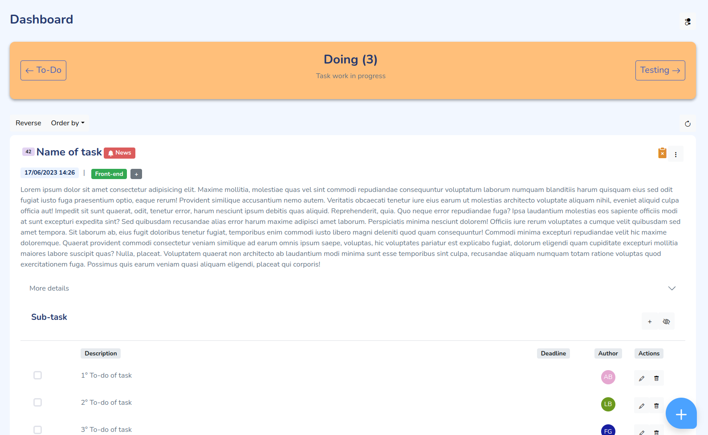

The _Dashboard_ is the application core. It is used to manage tasks.
Based on user's permission, the logged user is able to see all tasks or only assigned tasks.
Dashboard is divided in a different section for each task status. For example _To-do_ state, _Doing_ state, _Done_ state and so on.
Dashboard has a _sticky_ header used to keep in mind: the current task status visualized and the number of tasks for current status. It also has two buttons to go in the default _next_ and _prev_ status.
For example, _doing_ status may have _to-do_ as previously status and _done_ as next status.
In addition, other functionality are showed using the button in top-right side.

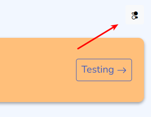

In the dashboard, each task has its own card which shows all task's information.

> Task can be refreshing using the button on the right side.

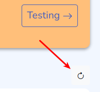

### Order by

Each section can be ordered by **priority** or **deadline** (ascending or descending) using specific button.

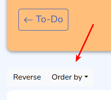

### Priority

Each task has a priority value which indicates the _priority of task_. The priority increases with the corresponding numerical value.
This value is shown in the badge on left of task name.

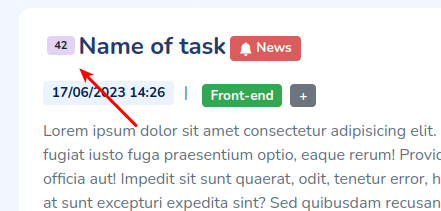

### More details

The _More details_ section is a collapsible section which is used to show secondary information of the task as the author, creation date, identifier task code and so on.

### Labels


Labels are a fast visible identifiers. Usually, they are used to group tasks of common work areas, for example the _Front-end labels_ is assigned to all tasks that describe _a task to do for front-end of MyProject_.
The task's labels are shown in top of the task's card.
Using "+" button at the end of labels list it is possible to add a new label.
Clicking on a label it is possible remove that label.

### Create a New Task

Creating a new task is simple, clicking on _FAB_ button on bottom-right a modal will be showed.
It is used to insert name, description and priority of the new task. Checking the checkbox it is possible to assign yourself to the task. 

## User Profile

Each logged user is able to manage his own profile using _My Profile_ page. It can be accessed through dropdown menu on the header avatar:

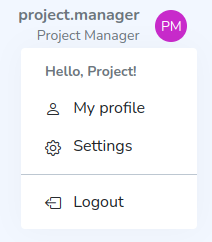

From _My Profile_ page is possible to edit user master data (name, surname, username, email and so on), avatar color and the password.

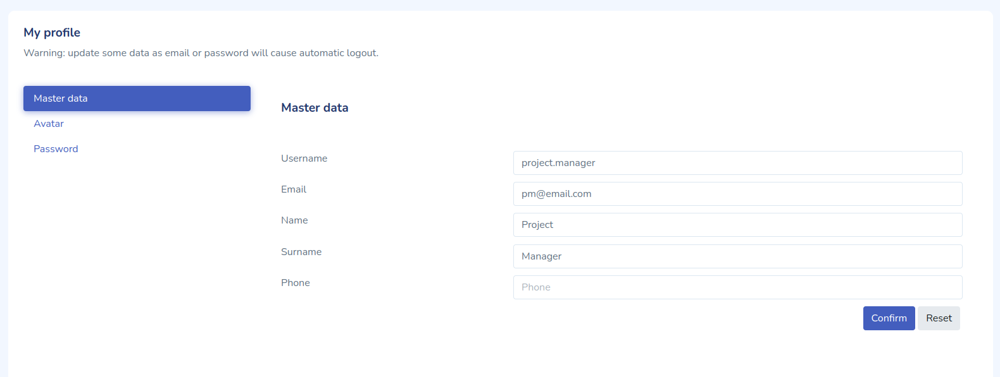

> WARNING: when a user edits email or password, he will be logged out.

## Manage Task Status, Task Labels, Users and Roles

With the appropriate permissions, a user, as a project manager (PM), is able to manage task status, task labels, users, and roles.

There are the corresponding pages to manage each of these items. Each page is shown only if the corresponding permission is satisfied. 
The user interface (UI) is the same for all pages. From these pages, it is possible to:

- Create a new resource
- Edit resources
- Delete resources

For example, the _Manage Task Label_ page looks like this:

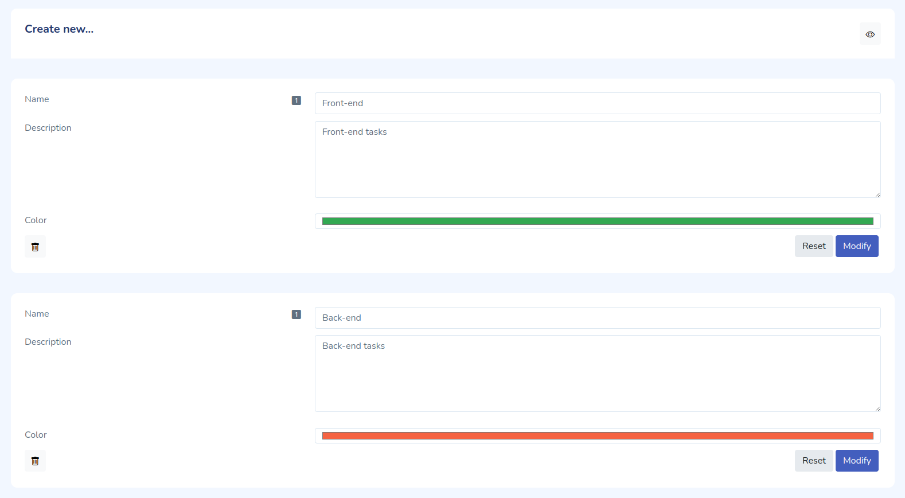

In addition, if there are a lot of resources, it is possible to use filters.

## Home

**Home page** provides a set of sections where is possible:

- Watch _project information_
- _Initialize_ new project
- _Open_ projects

### Project Information

In this section, it is possible to see the project's path, its app's database, and if the logged-in user has the 
specific permission, this app can be removed from the project.

### Initialize Project

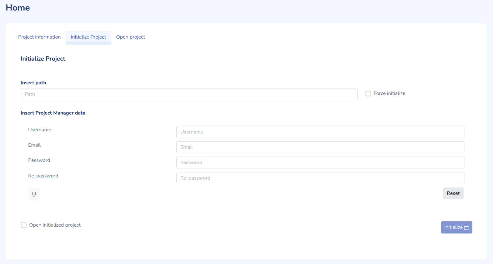

In this section is possible to initialize a project.

To initialize a project, it is necessary to indicate the project's path and provide basic information about the 
project's **project manager** who oversees the project.

> **WARNING**: Avoid to lose project manager's password, because the nature of this application makes it impossible
> to recover password without previously login.

If the indicated project is already initialized, checking _force initialize_ is possible to
re-initialize project.

### Open Project

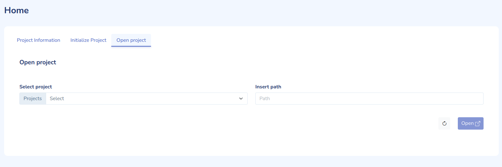

Open project is possible in two-way:

- Manually entering the path
- Selecting the path from a set of already opened projects

# Documentation for Developers

This is a basic and simple documentation to illustrate this project to both old and new developers. 
For the complete documentation, please refer to the _Sphinx documentation_.

## How to generate Sphinx documentation?

To run Sphinx doc:

1. Navigate to the `/doc` directory
2. Run `sphinx-apidoc -o source/ ..` or `sphinx-apidoc -o source/ ../lib` to refresh only lib packages
3. Run `make html`
4. Go in `doc/build/html`

## Keyword

- **Base Directory:** Refers to the project directory path
- **Project Directory:** Refers to the path of the managed project
- **Work Directory:** Refers to the work directory inside the _project directory_

## App


### AppManager and its Services

**AppManager** is the class which provides methods to manage this app.
In particular, AppManager has a set of _services_, which are classes that provide specific functionality.
For example `AuthService` provides _authentication system_.

AppManager **has only one** service reference for each type to avoid duplications when exposed by the Eel library.
Therefore, the services need to be refreshed instead of re-instantiated.

#### ProjectManager

**ProjectManager** manage the _projects_, usually only one project at time.
It allows initializing a new project or opening an existing project.

#### AuthService

**AuthService** provides _authentication system_.
It also manages _vault_ (`vault.json`), where "remember me" user credentials are stored.

### Eel and WebSocket

This project uses the [Eel library](https://github.com/python-eel/Eel) to send data between the client (frontend) and the server
(Python). Eel is a little Python library for making simple Electron-like offline HTML/JS GUI apps, with full access to Python capabilities and libraries.

Eel hosts a local web server and allows functions in Python to be called from JavaScript, and vice versa.


The App class in `app.py` implements `__init__` and `start` methods to load and start Eel. It takes the configuration files
from `settings.json` using the Settings class.
In the `__init__` method, it uses the Exposer class to expose all methods for frontend.

#### Exposer

The Exposer class is responsible for exposing methods using the "expose" methods of Eel. Specifically, 
Eel provides two methods to expose a function (other than `@expose` decorator):

- `expose()`, which exposes a method (and function) as it is
- `_expose()`, which is a _protected_ method of Eel library. It exposes a method or function with an _alias_. This is particularly important because the entity managers have methods with the same names for creating, reading, updating, and other operations on entities. Each manager has its own prefix. For example, the UsersManager has the prefix "user_". For more information on how to set an alias in Eel, refer to  [here](#how-to-set-alias-in-eel).

#### Webserver

The Eel's webserver implements a [**Web Socket**](https://en.wikipedia.org/wiki/WebSocket) for data transmission.
It is hosted on port 8000 (as specified in `app.py`), so in development mode, the frontend needs to be hosted on a different port, such as port 4200.
Refer to [here](#how-to-run-angular-and-eel-together-in-develop-mode) for more information.

Since the webserver is implemented with WebSocket, only **one** data transfer can occur at a time.

## Database and Entities

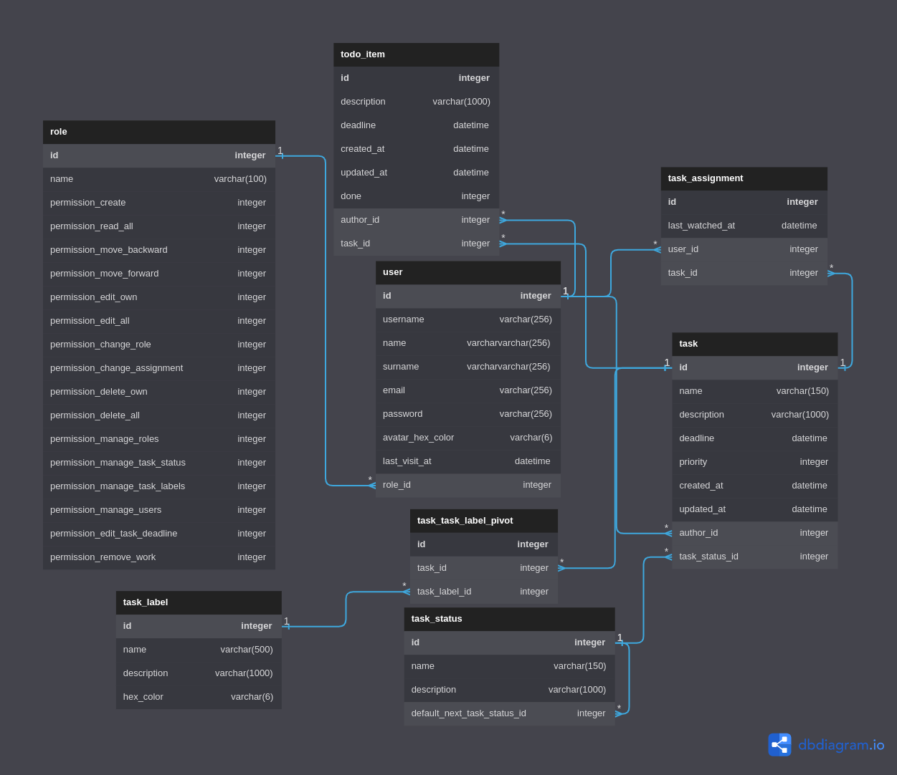

### DBManager

The **DBManager** class is used to establish a connection with the database. It also provides functionality to create the basic structure of the database, including tables and relationships between them.

### BEM

The **BEM** class serves as the base class for _entity models_. It implements several common and useful methods.

### EntitiesManager

The **EntitiesManager** class serves as the base class for _entity managers_. These managers are responsible for managing entities, such as finding, creating, and deleting them.

### User, Task, TaskLabel and so on Managers

The entities (**User**, **Task**, **TaskLabel**, etc.) are classes used to manage individual entities in the database. Each entity manager has shared base methods as well as specific methods. For example, the _TaskManager_ and _TaskLabelManager_ have an `add_label` method to add a label to a specific task.

### QueryBuilder

The **QueryBuilder** is a custom _query builder_ based on Python `sqlite3` module. It provides utilities for constructing queries using Python code instead of raw SQL. It also supports binding values using the `enable_binding` method.

### Trigger

During the creation of tables (using the `Table` component from the _db_ module, which accepts a list of Field objects, as well as other parameters such as `FKConstraint` and `Trigger`), a set of triggers is configured. 
These triggers are used to update the `updated_at` field of the task table whenever a component linked to a task is modified.

There are _three_ triggers (on update, on create, and on delete) for the following tables: `todo_item`, `pivot_assignment`, and `pivot_labels`. However, for the task table, there is only an on update trigger, as it is unnecessary to update the field when a task is created or deleted.

## Frontend

The frontend of this application is built using the _Angular framework_. 
Angular is a TypeScript-based, free and open-source web application framework led by the Angular Team at Google and a community of developers and organizations. 
The frontend is structured as follows:

- **page**: This directory contains the final pages of the application, such as the _login_ page and _home_ page
- **widget**: This directory contains simple widgets that are shared between pages, such as a _user avatar_
- **service**: This directory contains _services_ that are used to implement shared methods and handle communication with the backend
- **model**: This directory contains interfaces for objects that represent entity data to be displayed
- **directive**: This directory contains _custom_ Angular directives

### Services

In Angular, services are used to manage connections with the backend and provide additional functionality to the application. 
To communicate with the Eel backend, an `EelService` was implemented. It utilizes a globally declared variable `eel` to provide the `call` method, which is used to invoke Python-exposed methods.

### EntityApiService

The `EntityApiService` is a service used to share common methods among entity services. 
It utilizes a generic type that represents the specific _entity model_, allowing it to be used in various methods. Each method returns a **Promise of Observable**, 
where the observable is connected to the backend's WebSocket. To invoke specific methods of entity services, this class utilizes **readonly abstract variables**, which are overridden by each child service.

For example, the `find` method retrieves the data of an entity by its ID.

```typescript
export abstract class EntityApiService<T> {

  readonly abstract ALL: string;

  constructor(public eelService: EelService) { }

  public async find(id: number): Promise<Observable<T>> {

    return this.eelService.call(this.FIND, id);
  }
}
```

Using, for example, TaskService: 

```typescript
this.taskService.find(id).then((respose) => {
    respose.subscribe({
      next: (task: TaskModel) => {
        // ...
      }
    })
})
```

In addition, the _entities services_ as `TaskService` or `UserService` have other specific methods.
For example, `TaskService` has `addAssignment` method:

```typescript
public async addAssignment(taskId: number, userId: number): Promise<Observable<boolean>> {

    return this.eelService.call(this.ADD_ASSIGNMENT, taskId, userId);
}
```

### Task

The task visualization is made using a set of widgets:

- **TaskPreview**: This is the main component that represents a card displaying all the information about a task, such as the title, description, and more
- **TaskPreviewList**: This component is used to display a list of tasks by rendering multiple instances of the _TaskPreview_ component
- **TaskTodo** and **TaskTodoList**: These components are used to show the list of todo items associated with each task. The _TaskTodo_ component represents an individual todo item, while the _TaskTodoList_ component displays a list of todo items for a specific task.

## Help the Open Source Community

### How to run Angular and Eel together in develop mode?

1. Run Angular frontend with `ng serve` using 4200 port (the default port)
2. Set Eel using whatever directory, but using `{ 'port': 4200 }` as start file!
3. Set another port (i.e. 8000) in Eel `.start(...)`
4. Run Eel python script

### How to set alias in Eel?

```python
import eel

class MyClass:
   def my_method(self):
      pass

my_class = MyClass()
eel._expose("other_name", my_class.my_method)
```

Watch out "**_**" in `_expose(...)`, it is different from `expose(...)`

## Credits, libraries and plug in used

- Bootstrap framework
- Bootstrap icon
- Eel library
- Sqlite3 library
- Colorama library
- Mazer template